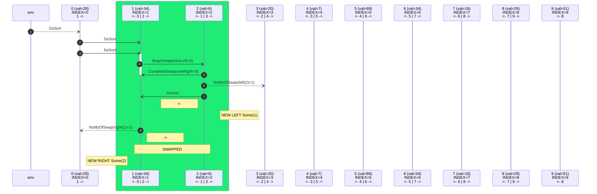
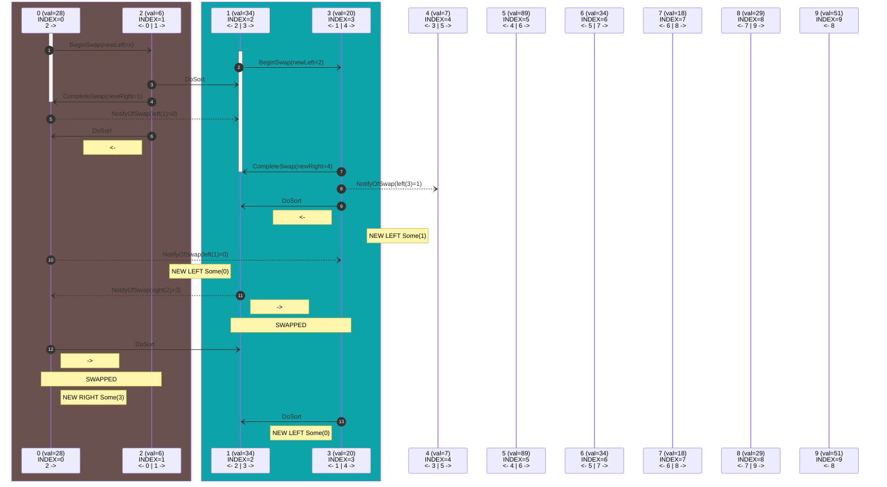
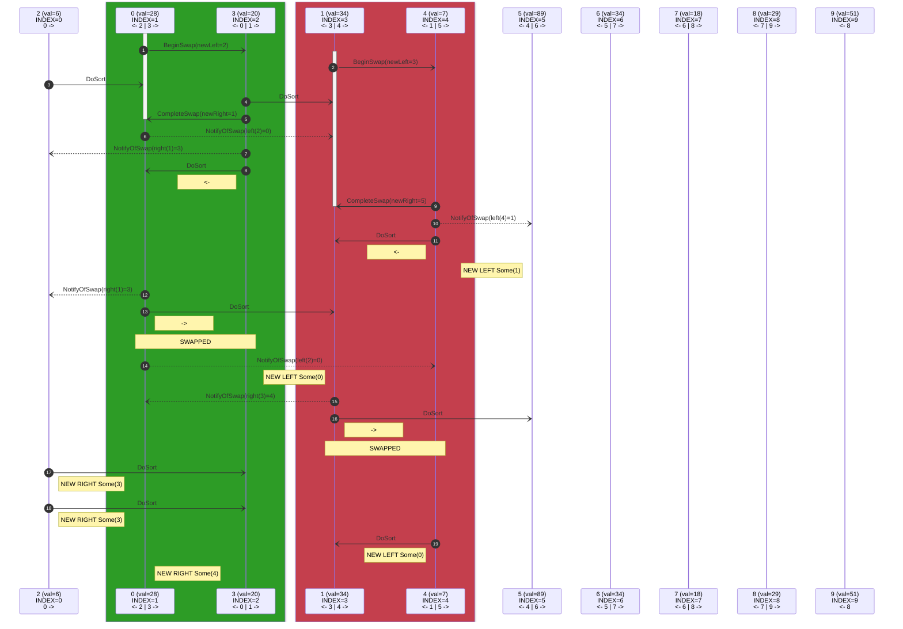
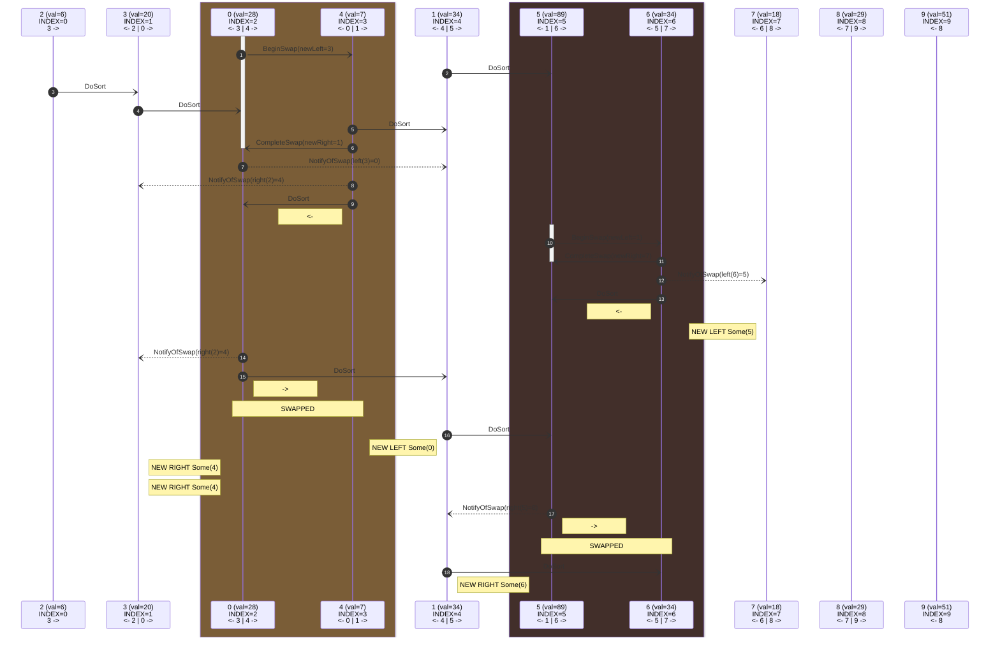
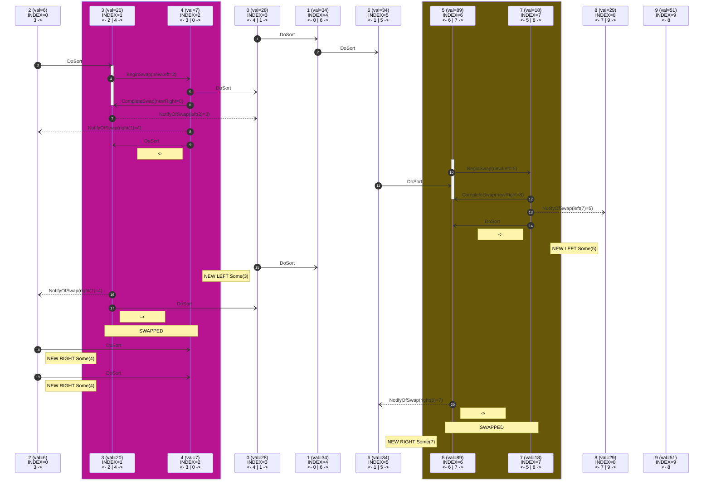
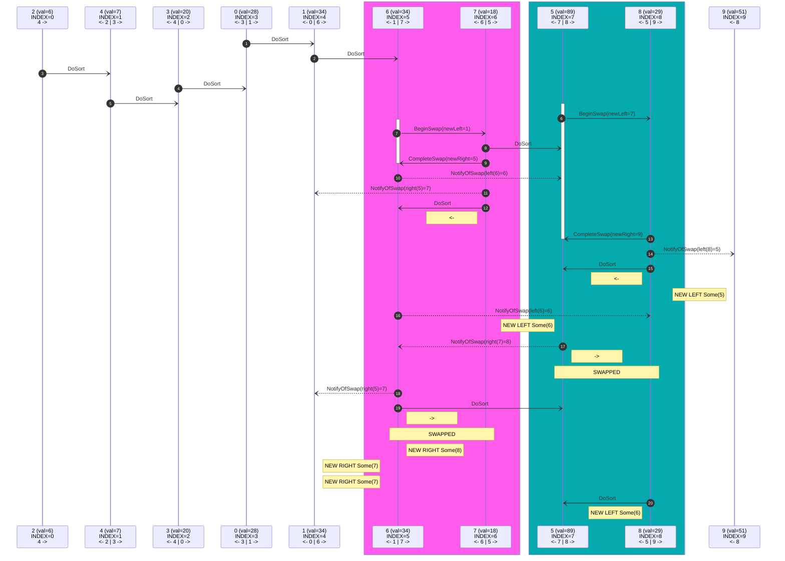
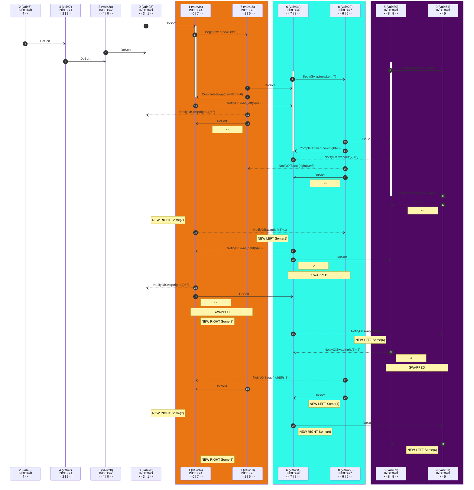
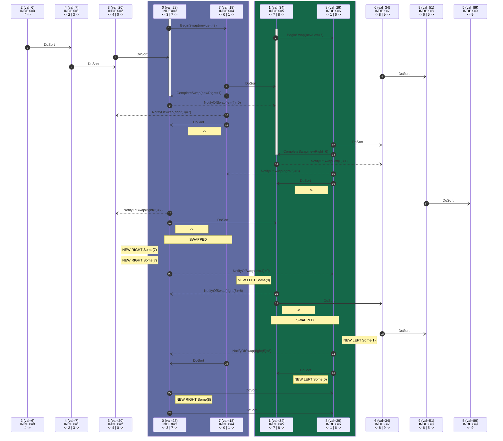
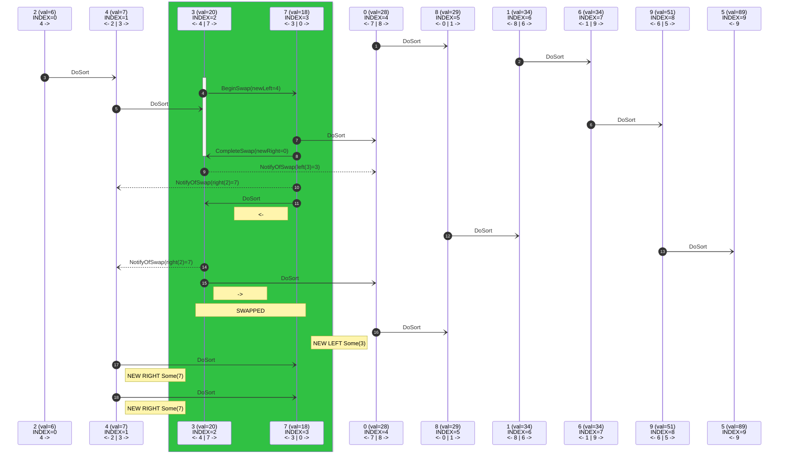
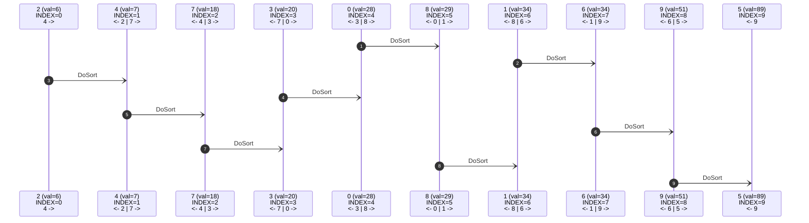

starting...
# t=1


# t=2


# t=3


# t=4


# t=5


# t=6


# t=7


# t=8


# t=9



- ⏰(9) \[2, 4, 7, 3, 0, 8, 1, 6, 9, 5]
# t=10



- ⏰(10) \[2, 4, 7, 3, 0, 8, 1, 6, 9, 5]
# t=11


- ⏰(11) \[2, 4, 7, 3, 0, 8, 1, 6, 9, 5]
# t=12


- ⏰(12) \[2, 4, 7, 3, 0, 8, 1, 6, 9, 5]
# t=13


- ⏰(13) \[2, 4, 7, 3, 0, 8, 1, 6, 9, 5]
# t=14


- ⏰(14) \[2, 4, 7, 3, 0, 8, 1, 6, 9, 5]
# t=15


- ⏰(15) \[2, 4, 7, 3, 0, 8, 1, 6, 9, 5]
# t=16


- ⏰(16) \[2, 4, 7, 3, 0, 8, 1, 6, 9, 5]
# t=17


- ⏰(17) \[2, 4, 7, 3, 0, 8, 1, 6, 9, 5]
# t=18


- ⏰(18) \[2, 4, 7, 3, 0, 8, 1, 6, 9, 5]
# t=19


- ⏰(19) \[2, 4, 7, 3, 0, 8, 1, 6, 9, 5]
# t=20


- ⏰(20) \[2, 4, 7, 3, 0, 8, 1, 6, 9, 5]
# t=21

```mermaid
sequenceDiagram
    autonumber
    participant C2 as 2 (val=6)<br/>INDEX=0<br/>4 ->
    participant C4 as 4 (val=7)<br/>INDEX=1<br/><- 2 | 7 ->
    participant C7 as 7 (val=18)<br/>INDEX=2<br/><- 4 | 3 ->
    participant C3 as 3 (val=20)<br/>INDEX=3<br/><- 7 | 0 ->
    participant C0 as 0 (val=28)<br/>INDEX=4<br/><- 3 | 8 ->
    participant C8 as 8 (val=29)<br/>INDEX=5<br/><- 0 | 1 ->
    participant C1 as 1 (val=34)<br/>INDEX=6<br/><- 8 | 6 ->
    participant C6 as 6 (val=34)<br/>INDEX=7<br/><- 1 | 9 ->
    participant C9 as 9 (val=51)<br/>INDEX=8<br/><- 6 | 5 ->
    participant C5 as 5 (val=89)<br/>INDEX=9<br/><- 9
    C0-)C8: DoSort
    C1-)C6: DoSort
    C2-)C4: DoSort
    C3-)C0: DoSort
    C4-)C7: DoSort
    C6-)C9: DoSort
    C7-)C3: DoSort
    C8-)C1: DoSort
    C9-)C5: DoSort
```

- ⏰(21) \[2, 4, 7, 3, 0, 8, 1, 6, 9, 5]
# t=22

```mermaid
sequenceDiagram
    autonumber
    participant C2 as 2 (val=6)<br/>INDEX=0<br/>4 ->
    participant C4 as 4 (val=7)<br/>INDEX=1<br/><- 2 | 7 ->
    participant C7 as 7 (val=18)<br/>INDEX=2<br/><- 4 | 3 ->
    participant C3 as 3 (val=20)<br/>INDEX=3<br/><- 7 | 0 ->
    participant C0 as 0 (val=28)<br/>INDEX=4<br/><- 3 | 8 ->
    participant C8 as 8 (val=29)<br/>INDEX=5<br/><- 0 | 1 ->
    participant C1 as 1 (val=34)<br/>INDEX=6<br/><- 8 | 6 ->
    participant C6 as 6 (val=34)<br/>INDEX=7<br/><- 1 | 9 ->
    participant C9 as 9 (val=51)<br/>INDEX=8<br/><- 6 | 5 ->
    participant C5 as 5 (val=89)<br/>INDEX=9<br/><- 9
    C0-)C8: DoSort
    C1-)C6: DoSort
    C2-)C4: DoSort
    C3-)C0: DoSort
    C4-)C7: DoSort
    C6-)C9: DoSort
    C7-)C3: DoSort
    C8-)C1: DoSort
    C9-)C5: DoSort
```

- ⏰(22) \[2, 4, 7, 3, 0, 8, 1, 6, 9, 5]
